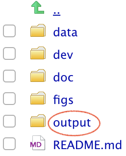

This is an [R Markdown](http://rmarkdown.rstudio.com) Notebook. 

# 1. Introduction
The *American National Election Studies* (ANES) are surveys of voters in the U.S. on the national scale. For each presidential election since 1948, ANES collects responses from respondents both before and after the election. The goal of ANES is to understand political behaviors using systematic surveys. ANES's data and results have been routinely used by news outlets, election campaigns and political researchers.

The *Time Series Cumulative Data* of ANES include answers, from respondents from different years, on selected questions that have been asked in three or more ANES' *Time Series* studies. Tremendous amount of efforts have been put into data consolidation as variables are often named differently in different years. 

A rule of thumb for analyzing any data set is to understand its study design and data collection process first. You are strongly encouraged to read the *codebooks*. 

# 2. Access to ANES Data
## Step 2.1: Register to access ANES dataset. 
To access the data, you should register at ANES's [website](https://electionstudies.org/) and accept its terms of use, especially committing to "use these datasets solely for research or statistical purposes and not for investigation of specific survey respondents."

## Step 2.2: Download the ANES Time Series Cumulative Data
Once you are logged into ANES's website, you should be able to download the data file. You can use ASCII, DTA or SAV. In this notebook, we use the *SAV* format. The downloaded file is a zip file, you should move all unzipped files into the `data` folder of your project 1's local folder. 


# 3. Data processing for this R Notebook.

The following code blocks prepare a processed data set and save it in the `output` folder. The data folder should be only used for storing raw `data`. All processed data should be saved in the `output` folder. The notion here is that one can delete files from the output folder and reproduce them by re-running the codes. 



### Step 3.1 Checking `R` packages for data processing

From the packages' descriptions:

+ `tidyverse` is an opinionated collection of R packages designed for data science. All packages share an underlying design philosophy, grammar, and data structures;
+ `haven` enables `R` to read and write various data formats used by other statistical packages. `haven` is part of the `tidyverse`.
+ `devtools` provides a collection of package development tools.
+ `RColorBrewer` provides ready-to-use color palettes.
+ `DT` provides an R interface to the JavaScript library DataTables;
+ `ggplot2` a collection of functions for creating graphics, based on The Grammar of Graphics.

```{r load libraries, warning=FALSE, message=FALSE, include=FALSE}
packages.used=as.list(
  c(
  "tidyverse",
  "haven",
  "devtools",
  "RColorBrewer",
  "data.table",
  "ggplot2")
)

check.pkg = function(x){
  if(!require(x, character.only=T)) install.packages(x, 
                                                     character.only=T,
                                                     dependence=T)
}

lapply(packages.used, check.pkg)
```


### Step 3.2 Import raw ANES data

We will be working with the SAV format of the raw ANES data, downloaded from [this page](https://electionstudies.org/data-center/anes-time-series-cumulative-data-file/), once you are registered *and* logged in. This is a saved data file from SPSS. We will use the `read_sav` function from the `haven` package. 

Read more about [importing SPSS data into R](https://www.marsja.se/how-to-read-write-spss-files-in-the-r-statistical-environment/).

```{r read in data, message = F}
library(haven)
anes_dat <-
    read_sav("../data/anes_timeseries_cdf.sav")
```

Some basic data summaries: there are `r nrow(anes_dat)` respondents and `r ncol(anes_dat)` variables.

```{r year barplot}
barplot(table(anes_dat$VCF0004),
        las=2,
        main="number of respondents over the years")
```

Some variables are asked nearly all the years and some are asked only a few years. 

```{r NAs}
anes_NAs=anes_dat%>%
  summarise_all(list(na.mean=function(x){
                              mean(is.na(x))}))
anes_NAs=data.frame(nas=unlist(t(anes_NAs)))

ggplot(anes_NAs, aes(x=nas)) + 
  geom_histogram(color="black", 
                 fill="white",
                 binwidth=0.05)+
  labs(title="Fractions of missing values")
```

### Step 3.3 Process variables for analysis
In the following, we will create a few variables for this tutorial. These variables were selected based on their description in the ANES codebook. You are encouraged to look them up and read about how they were prepared. 


First let's look at our data. One advantage of using the SPSS SAV data is that the values are *labelled*. By converting labelled data to factor, you can easily reveal the responses encoded by numbers. We selected four variables for subsequent analysis and save the filtered data sets to the `output` folder. 

```{r labelled variables subset}
Election_years=as.character(seq(1952, 2016, 4))

anes_use=anes_dat%>%
  mutate(
    year=as_factor(VCF0004),
    turnout=as_factor(VCF0703),
    vote=as_factor(VCF0706),
    race=as_factor(VCF0105a),
    gender=as_factor(VCF0104)
  )%>%
  filter(year %in% Election_years)

library(data.table)

data.table(anes_use%>%
             select(year, turnout, vote, race, gender)%>%
             filter(!is.na(turnout))%>%
             sample_n(30))


anes_use = anes_use%>%select(year, turnout, vote, race, gender)

save(anes_use, file="../output/data_use.RData")
```

# 4. A simple analysis

## 4.1 Who went to vote in the election?

First, we would like to see whether different racial groups have different turnout rates on the election day.


```{r turnout analysis, fig.height=14, fig.width=8}
load(file="../output/data_use.RData")
anes_to_race_year = anes_use %>%
  filter(!is.na(race) & !is.na(turnout))%>%
  group_by(year, race)%>%
  count(turnout)%>%
  group_by(year, race)%>%
  mutate(
    prop=n/sum(n)
  )

ggplot(anes_to_race_year, 
       aes(x=year, y=prop, fill=turnout)) +
  geom_bar(stat="identity", colour="black") + facet_wrap(~race, ncol=1) + theme_bw()+
  theme(axis.text.x = element_text(angle = 90))+
  scale_fill_brewer(palette="Blues")+
  labs(title="How did different racial groups participated in the election \n over the years?")
```

Wait a minute, this is not what we saw in the news!


Looks like other people have noticed it too and wrote a [whole paper](https://doi.org/10.1017/pan.2018.36) about this.


## 4.2 Who did they vote for in the election?


```{r vote analysis, fig.height=14, fig.width=8}
anes_vote_race_year = anes_use %>%
  filter(!is.na(race) & !is.na(vote))%>%
  filter(vote!="7. Did not vote or voted but not for president (exc.1972)")%>%
  group_by(year, race)%>%
  count(vote)%>%
  group_by(year, race)%>%
  mutate(
    prop=n/sum(n)
  )
#%>%
#  filter(vote == "1. Democrat" | vote == "2. Republican")

ggplot(anes_vote_race_year, 
       aes(x=year, y=prop, fill=vote)) +
  geom_bar(stat="identity", colour="black")+ 
  scale_fill_manual(values=c("dodgerblue3", "firebrick2", "gold1", "lightgoldenrod1"))+
  facet_wrap(~race, ncol=1) + 
  theme(axis.text.x = element_text(angle = 90))+
  labs(title="Who did racial groups vote for in the election \n over the years?")
```
## 5. The voting relationship with thier family burden and duty
## 5.1 voting due to children they have
```{r 5.1}
load(file="../output/data_use.RData")
Election_years=as.character(seq(1952, 2016, 4))

anes_burden=anes_dat%>%
  mutate(
    Number_of_children=as_factor(VCF0138),
    children_under_6=as_factor(VCF0138a),
    children_6_9=as_factor(VCF0138b),
    children_10_13=as_factor(VCF0138c),
    children_14_17=as_factor(VCF0138d),
    social=as_factor(VCF0148a),
    work_st=as_factor(VCF0116),
    work_HH=as_factor(VCF0117),
    vote=as_factor(VCF0706),
    gender=as_factor(VCF0104),
    turnout=as_factor(VCF0703),
    year=as_factor(VCF0004)
    
  )%>%
  filter(year %in% Election_years)

```

##5.1.1 Participating due to number of children they have
```{r 5.1.1}
load(file="../output/data_use.RData")
anes_to_children= anes_burden %>%
  filter(!is.na(Number_of_children) & !is.na(turnout))%>%
  group_by(Number_of_children,year)%>%
  count(turnout)%>%
  group_by(Number_of_children,year)%>%
  mutate(
    prop=n/sum(n)
  )

ggplot(anes_to_children, 
       aes(x=year, y=prop, fill=turnout)) +
  geom_bar(stat="identity", colour="black")+ 
  facet_wrap(~Number_of_children, ncol=2) +
  theme_bw()+
  theme(axis.text.x = element_text(angle = 90))+
  scale_fill_brewer(palette="Purples")+
  labs(title="How did people with different number of children \n participate in the election over the years?")
```
People with no child participated most in the election

##gender effect in having the same amount of children
```{r 5.1.2,fig.height=10, fig.width=8}
load(file="../output/data_use.RData")
anes_to_children2= anes_burden %>%
  filter(!is.na(Number_of_children) & !is.na(vote) & !is.na(gender) )%>%
  group_by(Number_of_children,gender,year)%>%
  count(vote)%>%
  group_by(Number_of_children,gender,year)%>%
  mutate(
    prop=n/sum(n)
  )

ggplot(anes_to_children2, 
       aes(x=year, y=prop, fill=vote)) +
  geom_bar(stat="identity", colour="black")+ 
  facet_wrap(~Number_of_children+gender, ncol=2) +
  theme_bw()+
  theme(axis.text.x = element_text(angle = 90))+
  scale_fill_brewer(palette="Reds")+
  labs(title="who did people with different number of children vote over the years?")

```
There's no big difference between male and female when they have zero child. However, when they have children, female has higher rate of not voting or voting not for president than male. So gender and children both affect the voting decision and participating.
```{r 5.1.3,fig.height=10, fig.width=10}
load(file="../output/data_use.RData")
anes_to_children1= anes_burden %>%
  filter(!is.na(Number_of_children) & !is.na(turnout) & !is.na(gender) )%>%
  group_by(Number_of_children,gender)%>%
  count(turnout)%>%
  group_by(Number_of_children,gender)%>%
  mutate(
    prop=n/sum(n)
  )

ggplot(anes_to_children1, aes(x="", y=prop, fill=turnout)) +
  geom_bar(stat="identity", width=1) +
  coord_polar("y", start=0) +
  geom_text(aes(label = paste0(round(prop,3), "%")), position = position_stack(vjust=0.5)) +
  labs(x = NULL, y = NULL) +
  facet_wrap(~Number_of_children+gender, ncol=2) +
  theme_classic() +
  theme(axis.line = element_blank(),
          axis.text = element_blank(),
          axis.ticks = element_blank()) +
  scale_fill_brewer(palette="Blues")+
  labs(title="How did gender and number of children affect on the participation generally?")
```


## 5.2 voting due to their social classes
```{r 5.2,fig.height=10, fig.width=8}
load(file="../output/data_use.RData")
anes_to_social= anes_burden %>%
  filter(!is.na(social) & !is.na(vote))%>%
  group_by(social,year)%>%
  count(vote)%>%
  group_by(social,year)%>%
  mutate(
   prop=n/sum(n)
  )

ggplot(anes_to_social, 
       aes(x=year, y=prop, fill=vote)) +
  geom_bar(stat="identity", colour="black")+ 
  facet_wrap(~social, ncol=1)+
  theme_bw()+
  theme(axis.text.x = element_text(angle = 90))+
  scale_fill_brewer(palette="Reds")+
  labs(title="who did people in different working class vote over the years?")
```
From the distribution graph, we see that for average working and working class, they have more volatility in voting,there are almost more than 1/3 of them didn't vote or voted but not for presidents. And for the upper middle class, they vote more for Republican than others.


## 5.3 voting due to their work status
## 5.3.1 participation rate due to their working status

```{r 5.3 ,fig.height=14, fig.width=7}
load(file="../output/data_use.RData")
anes_to_work= anes_burden %>%
  filter(!is.na(work_st) & !is.na(turnout))%>%
  group_by(work_st,year)%>%
  count(turnout)%>%
  group_by(work_st,year)%>%
  mutate(
   prop=n/sum(n)
  )

ggplot(anes_to_work, 
       aes(x=year, y=prop, fill=turnout)) +
  geom_bar(stat="identity", colour="black")+ 
  facet_wrap(~work_st, ncol=1)+
  theme_bw()+
  theme(axis.text.x = element_text(angle = 90))+
  scale_fill_brewer(palette="Purples")+
  labs(title="How did people in different working status participating vote over the years?")
```

